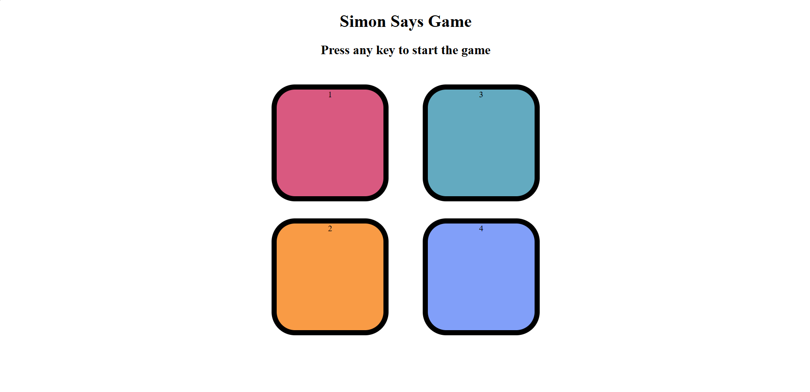

# Simon Says Game 

A fun and interactive browser-based memory game inspired by the classic **Simon Says**! Test your memory skills as the game shows you a sequence of colors that grows longer each round. Can you beat your highest score?

---

## Live Demo

 [Click here to play the game](https://ayushvupadhye.github.io/Simon-says-game/)

---

## Features

- Level-based progression  
- Flashing color buttons for game sequence  
- Clickable buttons for user input  
- Reset on mistake with score tracking  
- Tracks and displays your highest score  

---

## Project Files

- `index.html` – Main structure of the game  
- `style.css` – Styling and layout  
- `app.js` – Game logic and interactivity  

---

## How to Play

1. Press any key to start the game.  
2. Watch the sequence of flashing colors.  
3. Click the buttons in the same order as shown.  
4. Each correct level adds one more color to the sequence.  
5. Make a mistake? Game Over! Your current and highest scores will be displayed.  

---

## Screenshot

